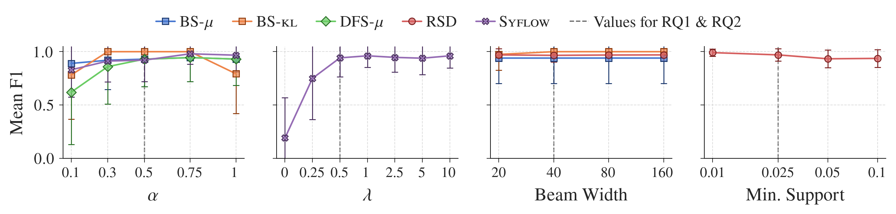

# Finding Exceptional Software Configuration Subspaces with Subgroup Discovery

This repository contains supplementary material for the paper "Finding Exceptional Software Configuration Subspaces with Subgroup Discovery" submitted to ICSE 2027. 

## Running Subgroup Discovery
All datasets, subgroup discovery methods and experiment scripts needed to replicate our evaluation are provided in this repository. The required Python packages are listed in the ```requirements.txt``` file.

The ```run.ipynb``` Jupyter Notebook can be used to try various subgroup discovery methods on the data used in the paper.

## Folder Structure

- *data*
  Performance measurements collected by Mühlbauer et al. and Kaltenecker et al.
- *experiments*
  An individual script for each experiment conducted in the paper
- *figures*
  Plots and tables used in the paper as well as the code to generate them
- *results*
  Results from our evaluation. In addition to the results presented in the paper, we include results on all systems (```figures/out/full```) and real-world-subspaces found by each method (```figures/out/rq3_real_world```)
- *scripts*
  Helper scripts to run our evaluation on a SLURM cluster
- *src*
  The implementations for all subgroup discovery methods used in the paper as well as the code required for our evaluation

## Additional Results for RQ3

We provide results for all methods compared in the paper on real-world data. As RSD optimizes for finding complementary sets of subgroups, we allow up to 15 subgroups for that method. For all other methods, we only provide the first 5 subgroups found.

## Hyperparameter Sensitivity

To evaluate hyperparameter sensitivity, we conducted a one-at-a-time analysis by seeding 1-3 exceptional subspaces on the `jump3r` subject system while varying one hyperparameter at a time.



The figure shows the average F1 score when seeding a single exceptional subspace; results for two and three subspaces can be found in ```figure/out/hyperparameter_sensitivity_*```. F1 scores remain largely stable across all tested ranges, with some deterioration only at smaller values of alpha and lambda. Our results confirm that the hyperparameter values chosen for RQ1 and RQ2, which lie above these ranges, do not sit at a boundary or inflection point for either subgroup discovery method.

## CART

As noted in the paper, we provide additional results for CART. By default, CART does not provide an inherent ranking of candidate subgroups. Therefore, we treat each tree node as a candidate subgroup and rank them using Kullback–Leibler divergence.
We ran our experiments for RQ1 and RQ2 (excluding scalability) using CART, visualized in ```figures/out/full```, and used CART on real world data, visualized in ```figures/out/rq3_real_world/cart_*```. 

CART achieves high F1 scores in RQ1, often outperforming Syflow and RSD. However, this performance is largely an artifact of our experimental design. The synthetic data seeds subspaces into otherwise randomized data, inducing a mean shift tied to exactly the configuration options involved in the seeded subspace. Furthermore, the seeded subspaces are independent and do not overlap, allowing CART to split on exactly the options that describe a certain subspace without being locked out of another. Consequently, our experimental setup presents a near best-case scenario for CART and does not expose its limitations as a subgroup discovery method.

These limitations become evident in the real-world setting. A qualitative analysis shows that CART predominantly identifies redundant subspaces driven by early tree splits, resulting in limited diversity, high overlap, and low aggregate coverage. In addition, CART systematically favors unimodal subspaces concentrated at distributional extremes, thereby missing broader patterns.

Taken together, these findings indicate that CART's strong performance on synthetic benchmarks does not generalize to realistic data, leading us to exclude CART from the our evaluation in the paper.
